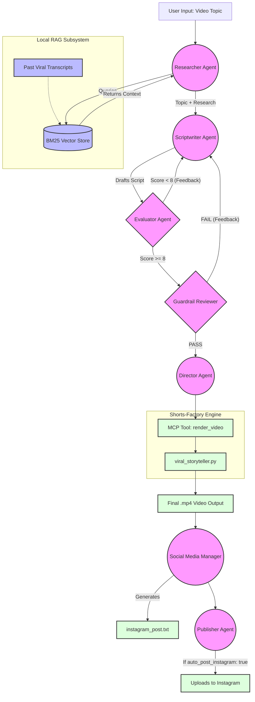

# AI Shorts-Factory: Multi-Agent Video Pipeline 🤖🎬

An open-source, autonomous, multi-agent AI pipeline for generating highly engaging YouTube Shorts. This architecture uses **LangGraph**, **Groq**, and a local **BM25 RAG pipeline** to fully automate the ideation, scriptwriting, compliance checking, and video rendering of YouTube Shorts using python libraries like `moviepy` and `edge_tts`.

---

## 🏗️ Architecture Overview

The pipeline is powered by **LangGraph**, which allows for a cyclical state machine. If an agent fails a task (e.g., the script violates financial guardrails), the graph automatically loops back to rewrite it.



### 1. The RAG Subsystem (`agents/rag.py`)
To ensure the generated scripts match your channel's exact tone and "Growth Blueprint" style, the pipeline utilizes a **BM25 Retrieval-Augmented Generation (RAG)** system.
- It scans the text transcripts of your previous viral videos.
- It is 100% local, requiring no API keys or external embeddings, ensuring maximum speed and stability.

### 2. The Agent Nodes (`agents/graph.py`)
There are six distinct agent "nodes" in the workflow:
1. **The Researcher 🕵️‍♂️**: Queries the local RAG database to find historical context, trending hooks, and relevant financial data based on your topic.
2. **The Scriptwriter ✍️**: Drafts a highly engaging 60-second script. It uses psychological triggers (fear/greed) while incorporating the data found by the Researcher.
3. **The Quality Evaluator 🎯**: Uses the official **DeepEval** framework (G-Eval programmatic metrics) to strictly grade the drafted script on Hook Strength, Conciseness, and Actionable Authority from 1-10. If the score is below 8, it rejects the script and forces the Scriptwriter to make it punchier.
4. **The Guardrail Reviewer 🛡️**: A strict compliance agent. It evaluates the drafted script against your channel's safety rules (e.g., no guaranteed profit claims, no illegal financial advice). If it fails, it rejects the script and forces the Scriptwriter to try again with feedback.
5. **The Director 🎬**: Once the script is approved, the Director takes over. It configures the video parameters and physically triggers the `shorts-factory` rendering engine.
6. **The Social Media Manager 📱**: Once the video is rendered, this agent automatically drafts an engaging Instagram post, highly targeted hashtags, and a click-worthy title for maximum reach. The output is saved to `outputs/instagram_post.txt`.
7. **The Publisher 🚀**: (NEW) If enabled in `shorts_config.yaml`, this agent logs into Instagram and autonomously publishes the final video with the generated caption as a Reel!

---

## 🚀 Quickstart Guide

### Step 1: Clone and Install
```bash
git clone https://github.com/yourusername/shorts-factory.git
cd shorts-factory
python -m venv venv
source venv/bin/activate
pip install -r requirements.txt
```

### Step 2: Setup Environment Variables
Create a `.env` file in the root directory and add your API keys:
```env
GROQ_API_KEY='your-groq-api-key'
```

### Step 2: Extract Transcripts
If you add new `.mp4` videos to `inputs/channelvideo/`, you can extract their scripts to feed the RAG pipeline.
Add your own background videos to the inputs/channelvideo/ folder to start their own factory!
```bash
source venv/bin/activate
python agents/extract_transcripts.py
```

### Step 3: Ingest Data into RAG
To load your text files from `inputs/rag_data/` into the BM25 vector database, run:
```bash
python agents/rag.py
```

### How to Run

There are three distinct workflows you can use depending on your needs. Ensure you are in the virtual environment and have the python path set:
```bash
source venv/bin/activate
export PYTHONPATH=.
```

#### Workflow 1: The Full Multi-Agent Pipeline
*Best for: Generating a video using existing background footage, utilizing RAG, DeepEval, and Social Media generation.*
```bash
python agents/graph.py "The dangers of zero day options"
```

#### Workflow 2: 100% AI-Generated Video Pipeline
*Best for: Generating a completely new video from scratch using AI image generation (no local footage required).*
```bash
python agents/text_to_video_agent.py "Don't let emotions ruin your trading account. The fear of missing out, or FOMO, is the number one reason beginners lose their capital. Let the market come to you."
```

#### Workflow 3: Start the MCP Server
*Best for: Exposing the rendering engine and social media generator to external AI agents (like Claude Desktop).*
```bash
python servers/mcp_server.py
```

---

## 📁 Directory Structure
- `agents/extract_transcripts.py`: Uses faster-whisper to transcribe your existing `.mp4` videos into `.txt` files.
- `agents/rag.py`: The BM25 knowledge base. Chunks your `.txt` files and saves the retriever.
- `agents/graph.py`: The core LangGraph state machine. Defines the Agent Prompts and routes them.
- `agents/tools.py`: Contains the `render_video` tool which safely edits `core/config.yaml` and executes the video compilation.

---

## 🛠️ Customizing the Agents
You can easily adjust the behavior of your agents by modifying their prompts in `agents/graph.py`:
- **Change Tone**: Edit the `scriptwriter_node` prompt to make the videos more poetic or more aggressive.
- **Add Rules**: Edit the `guardrail_node` prompt to add strict rules (e.g., "Must include the phrase 'Not Financial Advice'").
